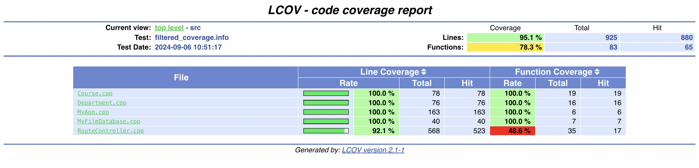

# COMS 4156 Mini Project

## Dependencies

```bash
brew install asio lcov
brew install llvm  # clang-tidy
```

> [!IMPORTANT]\
> Ensure binaries, such as `clang-tidy`, are in your PATH before proceeding.

## TL;DR: Build + Lint + Run All Tests + Code Coverage

```bash
mkdir build && cd build
cmake .. && make
make cpplint

./mini_project setup
./mini_project
```

In a separate terminal:

```bash
cd build
./mini_project_test
./mini_project_integration_test

cd ..
chmod +x code_coverage.sh
./code_coverage.sh
```

> [!IMPORTANT]\
> Run the unit tests at least once before running the code coverage script. This ensures the
> required `.gcda` files are generated.

## Code Coverage Output



## Static Analyzer: clang-tidy

### Setup

```bash
cd build
cmake -DCMAKE_EXPORT_COMPILE_COMMANDS=1 ..
mv compile_commands.json ../compile_commands.json

cd ..
clang-tidy -p compile_commands.json src/* include/*
```

### (Optional) clangd integration

If set up properly, `clangd` can automatically detect the `compile_commands.json` file in the root directory, generated by the `clang-tidy` setup instructions.

The `clangd` LSP bundles `clang-tidy`, which is more convenient than re-running `clang-tidy` via CLI during development.
